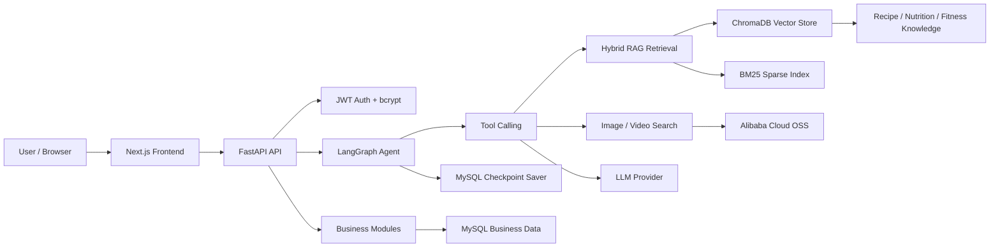

# AI Private Chef Butler

AI Private Chef Butler 是一个面向家庭饮食场景的智能私厨系统。项目基于 FastAPI、LangGraph Agent 与 RAG 架构，支持菜谱推荐、拍照营养识别、每周膳食计划、购物清单、冰箱库存、口味偏好和飞书推送等功能。

## Tech Stack

- Backend: Python, FastAPI, SQLAlchemy, MySQL
- AI Agent: LangChain, LangGraph, OpenAI-compatible LLM APIs
- RAG: ChromaDB, BGE Embedding, BM25, jieba
- Frontend: Next.js, React, TypeScript, Tailwind CSS
- Storage and deploy: Alibaba Cloud OSS, Docker, Nginx

## Architecture

> Current runtime architecture uses MySQL for business data and LangGraph checkpoints. Historical local SQLite files may still exist under `data/`, but they are not the active architecture.



## Core Features

- AI chat: streaming recipe consultation with user-specific context.
- Recipe management: save, search, batch create, update and delete recipes.
- RAG knowledge: recipe, nutrition and fitness knowledge retrieval.
- Nutrition tracking: photo-based food recognition and daily nutrition summary.
- Meal planning: AI-generated weekly plans with preference and inventory context.
- Shopping list: generate and manage ingredient purchase lists.
- Fridge inventory: track ingredient quantity, category and expiry state.
- Preferences: allergies, diet type, taste sliders and family members.
- Feishu integration: push meal and reminder messages to Feishu.

## Local Development

1. Copy `.env.example` to `.env` and fill required values.
2. Start MySQL and set `DATABASE_URL`.
3. Install dependencies with the project Python.
4. Run backend:

```bash
D:/Develop/python/python.exe -m uvicorn app.main:app --host 0.0.0.0 --port 8001 --reload
```

5. Run frontend:

```bash
cd frontend
npm install
npm run dev
```

## Quality Checks

```bash
D:/Develop/python/python.exe -m pytest
D:/Develop/python/python.exe scripts/collect_project_metrics.py
```

Generated metrics are written to `docs/PROJECT_METRICS.md`.
