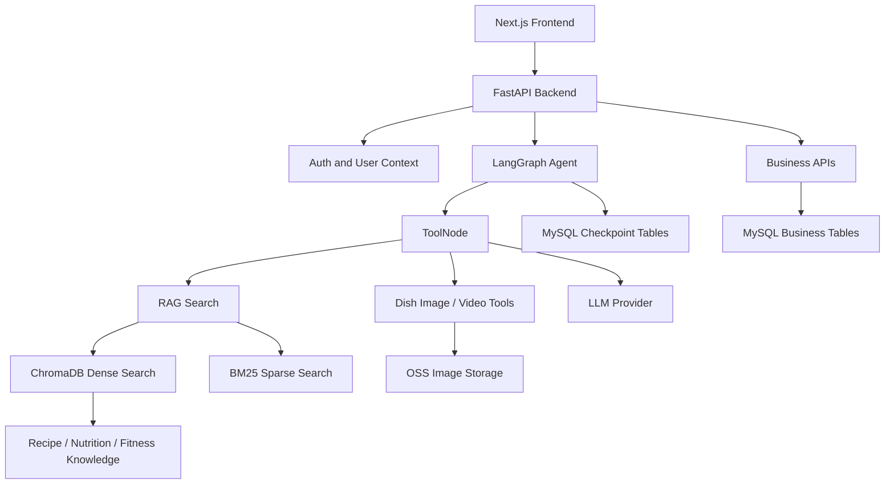

# Architecture

## Overview

AI Private Chef Butler uses a web frontend, a FastAPI backend, a LangGraph-based AI agent, a hybrid RAG retrieval layer and MySQL persistence.

## Backend Boundaries

- `app/api/v1`: REST and streaming API routes.
- `app/agents`: LangGraph agent, tool calling and media generation/search.
- `app/rag`: ChromaDB vector store, BM25 index and knowledge loaders.
- `app/models`: SQLAlchemy models and Pydantic schemas.
- `app/common`: shared database, logging, checkpoint and utility modules.

## Persistence

- MySQL stores users, recipes, nutrition records, inventory, shopping lists, preferences, Feishu config and LangGraph checkpoints.
- ChromaDB stores vectorized recipe, nutrition and fitness knowledge.
- OSS stores uploaded or generated food images when configured.

## Key Design Decisions

- Use MySQL instead of SQLite for active runtime persistence to support deployment and multi-user data isolation.
- Use LangGraph checkpoints in MySQL to preserve multi-turn conversations by `thread_id`.
- Use hybrid retrieval instead of vector-only retrieval to improve Chinese dish names, ingredient names and nutrition terms.
- Keep external model calls behind route and tool boundaries so tests can cover pure logic without calling real LLM services.
